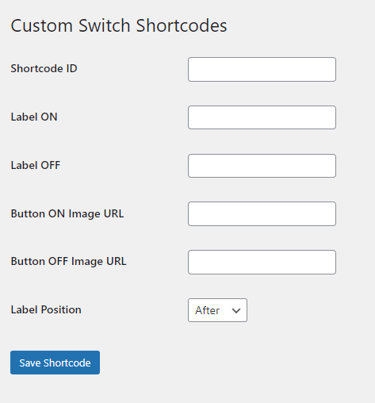
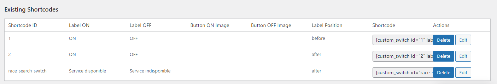
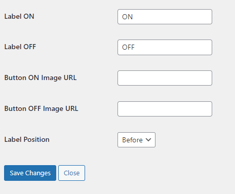
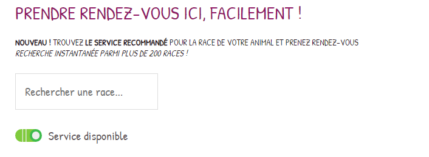
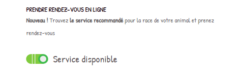

# WP Custom Switch

**Contributors:** johancoffigniez  
**Tags:** wp custom switch, wp, custom, switch, button, price, options  
**Donate link:** [Donate](https://www.paypal.me/johancoffigniez)  
**Requires at least:** 4.6  
**Tested up to:** 6.5.4  
**Stable tag:** 0.0.0

WP Custom Switch, Plugin WordPress pour créer des boutons switch personnalisables et administrables facilement. Testé sur la version 6.5.4 de WordPress.

---

## Description

Plugin WordPress pour créer des boutons switch personnalisables et administrables facilement. Ils peuvent être placés partout, et même clonés pour avoir le même état d'un bouton sur des pages différentes.

---

## Installation

1. Décompressez le fichier.
2. Téléversez dans `wp-content/plugins`.
3. Allez dans votre tableau de bord WordPress pour l'activer.
4. Amusez-vous !

---

## Frequently Asked Questions

### No more questions ?

Utilisez le bloc Gutenberg  
   Peut-être un jour...

Ou utilisez l'ancien shortcode :

1. Créez une page avec le nom que vous souhaitez.
2. Ajoutez le shortcode `[custom_switch id="votre_shortcode_id"]`.
3. Ajoutez des paramètres (label-on, label-off, button-on, button-off, label-position="after" ou label-position="before").

Exemple :  
`[custom_switch id="5" label-on="ON" label-off="OFF" button-on="wp-content/plugins/wp-custom-switch/assets/images/default/button_on.svg" button-off="wp-content/plugins/wp-custom-switch/assets/images/default/button_off.svg" label-position="after"]`

C'est tout !

---

## Screenshots

1. Default custom label and images
2. Shortcode form
3. Shortcode listing
4. Edit and delete shortcode
5. Other screenshots

<div>
  
  
  
  
  
</div>

---

## Changelog

### 1.0.1 - 17 juin 2024
* Bonne fête des pères pour hier ;)
* Ajout de la sécurité pour les modifications uniquement par l'administrateur
* Réorganisation du code

### 1.0.1 - 17 juin 2024
* Correction mineure - Ajout du nom de l'auteur

### 1.0.0 - 17 juin 2024
* Version initiale

---

## Arborescence

 ```plaintext
    wp-custom-switch/
    ├── actifs/
    │   ├── css/
    │   │   └── custom-button-style.css
    │   ├── js/
    │   │   └── custom-button-script.js
    │   └── images/
    │       └── par défaut/
    │           ├── bouton-on.svg
    │           └── bouton-off.svg
    ├── inclut/
    │   ├── class-wp-custom-switch.php
    │   └── admin/
    │       └── classe-wp-custom-switch-admin.php
    └── wp-custom-switch.php
    ```
